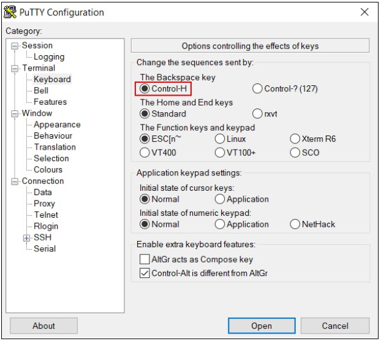
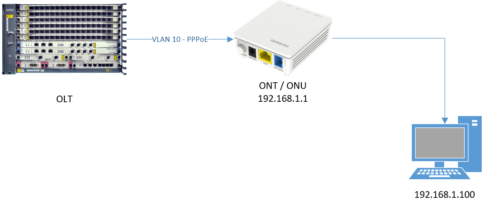
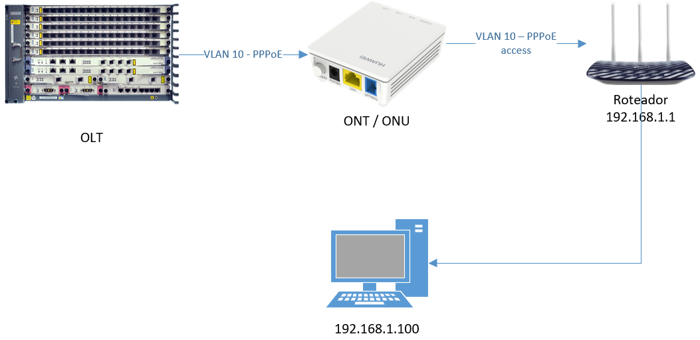

## Manual de configuração 

    Referência para configuração de equipamento Huawei ONT/ONU    
    
    Equip. Ref.: MA5683T | MA5800-X7
    Autor: Maicol Kaiser Oliveira

___

> A OLT Huawei usa o seguinte padrão ex:(0/0/0/0):

    FRAME  | 0 = Refere-se a OLT como um todo, neste caso o Chassi 
	SLOT   | 0 = Refere-se a placa inteira, no caso gpon GPHF = 1-7
	PORTA  | 0 = Porta do slot/placa = 0-15
	ONT ID | 0 = índice utilizado pela OLT para posicionar a ONT = 0-127

> A OLT Huawei segue um padrão de CLI, parecido com os equipamentos CISCO, mudando apenas alguns comandos.

    SWITCH1		        =	USER MODE
    SWITCH1#                =	PRIVILEGED MODE
    SWITCH1(config)#	=	GLOBAL CONFIGURATION MODE

>Para sair do modo (USER) e subir para o nível (PRIVILEGED), é necessário utilizar o comando “enable”, após isto digite 
ENTER.
>>Para sair do modo (PRIVILEGED) e subir para o nível (CONFIG), digite o comando “config”.
>>>Para descer os níveis utilize o comando “quit”.
```shell script
SWITCH1> enable
SWITCH1# config
SWITCH1(config)# quit
```

#### Recomendações:

> Caso você utilize o Putty para acessar a OLT, “dependendo do modelo”, pode ser que você tenha problemas ao utilizar o 
backspace(apagar), caso isto aconteça, você pode ativar o Control-H.
O recurso pode ser alterado mesmo após a sessão já ter sido estabelecida. Para fazer isto, clique com o botão direito 
do mouse na barra superior do Putty, vá em Change Settings… e então a tela abaixo irá aparecer.


 
`Para manter salva as configurações, faça todas as modificações recomendadas e só após isso, retorne ao menu 
“session”, selecione na lista de sessões a opção “Default settings” e então clique em “Save”.`

```
(opcional)
* Melhora a visualização do terminal

Configuration > Window > Appearance
	Fonte: Courier New -> regular -> 10px

Configuration > Window > Color
	Default foreground 	= R 255 | G 190 | B 27
	Default background 	= R 51  | G 51  | B 51
```

```
(opcional)
* DH Group 14: usa uma chave de 2048-bits

Configuration > Window > SSH > Kex > AJUSTAR A ORDEM 
	Diffie-Hellman group 14
	Diffie-Hellman group 1
	RSA-based key exchange
	Diffie-Hellman group exchange
```
---
#### Ferramentas para auxiliar com a organização

* SuperPutty - [download](https://www.puttygen.com/superputty)
* Solar-PuTTY - [download](https://www.solarwinds.com/pt/free-tools/solar-putty)

---
#### Provisionamento de ONT - Router

Cenário:
    
    * VLAN PPPoE 10
    * ONT WAN PPPoE 
    * ONT/ONU 192.168.1.1
    * DHCP 192.168.1.100-192.168.1.200


	

1. Localizar
    >Localizar a ONT/ONU não autorizada:
    ```shell script
    (config)#display ont autofind all
    ```
2. Identificar a posição
    > Identifique a posição da ONT/ONU:

    > F/S/P = Posição em que a ONT/ONU foi encontrada.  
    Ont SN = Serial number, ambos os formatos são aceitos.
			
   ```shell script
   Number              : 1
   F/S/P               : `0/1/0`
   Ont SN              : `E1E1E1E1E1E1E1E1 (HWTC-XXXXXXXX)`
   Password            : 0x00000000000000000000
   Loid                :
   Checkcode           :
   VendorID            : HWTC
   Ont Version         : 159D.A
   Ont SoftwareVersion : V5R019C00S050
   Ont EquipmentID     : EG8145V5
   Ont Customized Info : COMMON
   Ont autofind time   : 2019-10-22 11:43:35-03:00
   ```

3. Acessar o slot
    >Copie o Ont SN (double-click), e então acesse o SLOT (F/S) indicada pelo comando anterior.
    ```shell script
    (config)#interface gpon 0/1
    ```
4. Autorizar ONT/ONU na porta 
    >Após acessar o SLOT, precisamos autorizar a ONT/ONU utilizando o seguinte comando: 

    > O X no exemplo abaixo, refere-se a porta em que a ONT/ONU será provisionada.

    ```shell script
    (config-if-gpon-0/1)#ont add X sn-auth E1E1E1E1E1E1E1E1 omci ont-lineprofile-name ROUTER ont-srvprofile-name ROUTER 
   desc COD-CLI
   
   Command:
   ont add X sn-auth E1E1E1E1E1E1E1E1 omci ont-lineprofile-name ROUTER ont-srvprofile-name ROUTER desc COD-CLI
   
   Number of ONTs that can be added: 1, success: 1
   PortID :x, ONTID :77
   ```
   
    > É possível informar a posição da ONT/ONU inserindo no início do comando ex: 42.
    ```shell script
    (config-if-gpon-0/1)#ont add 77 42 sn-auth E1E1E1E1E1E1E1E1
    ```
    > Caso a posição já esteja em uso, as informações serão substituídas, então utilize com cuidado.

    > Assim que a ONT/ONU for provisionada, a OLT irá retornar qual posição (ONT-ID) que a ONT/ONU ganhou.  
    Caso você não tenha visto ou nao se lembre, você pode utilizar um dos comandos abaixo para descobrir o ONT-ID.
    
    ```shell script
    (config)#display ont info by-desc COD-CLI
    (config)#display ont info by-sn E1E1E1E1E1E1E1E1
    ---------------------------------------------------------
        F/S/P                   : 0/1/0
        ONT-ID                  : 0
    ```
   
5. Liberar o serviço
   > Agora que a ONT/ONU foi autorizada na porta, será necessário liberar o serviço para o cliente:

   > Neste exemplo a C-VLAN 10 deve ser configurada na ONT caso a vlan esteja trocada, será necessário alterar para vlan 10.
   
   ```
   GEMPORT = SERVIÇOS
   
		GEM 1 = GERÊNCIA    = vlan xx
		GEM 2 = DADOS       = vlan 10 - PPPoE
		GEM 3 = VOZ         = vlan xx
		GEM 4 = TV          = vlan xx
		GEM 5 = L2L         = vlan xxx
    ```

    > A  configuração das OLT’S / CONTROLADORES PPPoE, deve seguir o seguinte padrão:

    > Número com 4 dígitos fixos, sendo a primeiro número FIXO (2), os números seguintes se referem ao SLOT(2) 
    e PORTA(13), neste caso a posição seria 0/2/13.

   ```shell script
     Caso a ONT/ONU esteja na posição 0/1/13 a S-VLAN será     = 2113
     Caso a ONT/ONU esteja na posição 0/3/5 a S-VLAN será      = 2305
     Caso a ONT/ONU esteja na posição 0/0/0 a S-VLAN será      = 2000
   ```
   
   > Neste exemplo, vamos configurar apenas o serviço de dados.
   A C-VLAN 10 utilizada no exemplo é a vlan padrão utilizada pelo PPPoE e também é a mesma vlan configurada na ONT
   no serviço PPPoE.
 
   > Podemos ver que o índice do service-port, nos equipamento Huawei, são selecionado de maneira automática, caso você 
   informe (“Service-port 1022 vlan XXXX”), o comando irá utilizar este índice, e substituirá qualquer configuração 
   nesta posição.

   > Retornando ao passo 4, é possível encontrar o ONT-ID, caso você não consiga localizar, utilize os comandos de 
   auxílio no fim do documento para encontrar.

    ```shell script
    (config)#service-port vlan XXXX gpon X/X/X ont X gemport 2 multi-service user-vlan 10 tag-transform translate-and-add
    ```

#### Configuração de ONU - Bridge - Vlan untagged

Cenário:
    
    * C-VLAN 10 untagged ether 1
    * ONU BRIDGE 
    * Roteador wireless autenticando PPPoE na interface wan
    * Roteador 192.168.1.1
    * Roteador DHCP 192.168.1.100-192.168.1.200



1. Localizar 
    > Descoberta da ONT/ONU não provisionada:
    
    ```shell script
    (config)#display ont autofind all
    ```
   
2. Identificar a posição 
    > Identifique a posição da ONT/ONU:
    
    > F/S/P = Posição em que a ONT/ONU foi encontrada.  
        Ont SN = Serial number, ambos os formatos são aceitos.
    	
    ```shell script
    Number              : 1
    F/S/P               : `0/1/0`
    Ont SN              : `E1E1E1E1E1E1E1E1 (HWTC-XXXXXXXX)`
    Password            : 0x00000000000000000000
    Loid                :
    Checkcode           :
    VendorID            : HWTC
    Ont Version         : 159D.A
    Ont SoftwareVersion : V5R019C00S050
    Ont EquipmentID     : EG8145V5
    Ont Customized Info : COMMON
    Ont autofind time   : 2019-10-22 11:43:35-03:00
    ```

3. Acessar o slot 
    > Copie o Ont SN (double-click), e então acesse o SLOT (F/S) indicada pelo comando anterior.
   
   ```shell script
    (config)#interface gpon 0/1
   ```

4. Autorizar ONT/ONU na porta

      > Após acessar o SLOT, precisamos provisionar a ONT/ONU utilizando o seguinte comando:
        
      > O X no exemplo abaixo, refere-se a porta em que a ONT/ONU será provisionada
    
      ```shell script
       (config-if-gpon-0/1)#ont add 3 sn-auth E1E1E1E1E1E1E1E1 omci ont-lineprofile-name DADOS-BRIDGE ont-srvprofile-name 
       DADOS-BRIDGE desc COD-CLI
       
       Command:
       ont add 3 sn-auth E1E1E1E1E1E1E1E1 omci ont-srvprofile-name DADOS-BRIDGE ont-lineprofile-name 
       DADOS-BRIDGE desc COD-CLI
          
       Number of ONTs that can be added: 1, success: 1
         PortID :3, ONTID :7
      ```
       
      > Podemos ver que a OLT retorna o ID associado a ont adicionada, no caso acima é o ONTID :7

5. Encapsular frames untagged  
   
      > Com a ont autorizada na porta e com o ONTID em mãos, será necessário realizar um configuração direto na porta da ONT/ONU: 
   
      > Agora precisamos indicar que os frames untagged serão traduzidos para a vlan 10, neste caso a porta gpon é a 3
      com o ONTID 7

      ```shell script
      (config-if-gpon-0/1)#ont port vlan 3 7 eth 1 q-in-q 10 user-vlan untagged
      ```

      ```shell script
      Explicando o comando: 
    
      comando “ont port vlan” 
            3       = porta que o cliente está conectado F0/S1/´P3´
            7       = ONTID 
            eth1       = porta RJ45 LAN eth 1 da ont
            q-in-q 10   = q-in-q é a maneira como o pacote será transportado e a vlan 10 é a vlan padrão do pppoe server
            user-vlan untagged = pacotes sem marcação que estão vindo da porta        
      ```
      > Ou seja nos comandos acima só muda a porta que o cliente está e a posição da porta do cliente, o resto é sempre padrão.

6. Liberar o serviço 
    
    > Agora que a ONT já está provisionada e os frames untagged já estão traduzidos para a vlan 10, será necessário 
    liberar o serviço para o cliente:

   > Neste exemplo a C-VLAN 10 deve ser configurada na ONT caso a vlan esteja trocada, será necessário alterar para vlan 10.
   
   ```
   GEMPORT = SERVIÇOS
   
		GEM 1 = GERÊNCIA    = vlan xx
		GEM 2 = DADOS       = vlan 10 - PPPoE
		GEM 3 = VOZ         = vlan xx
		GEM 4 = TV          = vlan xx
		GEM 5 = L2L         = vlan xxx
    ```

    > A  configuração das OLT’S / CONTROLADORES PPPoE, deve seguir o seguinte padrão:

    > Número com 4 dígitos fixos, sendo a primeiro número FIXO (2), os números seguintes se referem ao SLOT(2) 
    e PORTA(13), neste caso a posição seria 0/2/13.

   ```shell script
     Caso a ONT/ONU esteja na posição 0/1/13 a S-VLAN será     = 2113
     Caso a ONT/ONU esteja na posição 0/3/5 a S-VLAN será      = 2305
     Caso a ONT/ONU esteja na posição 0/0/0 a S-VLAN será      = 2000
   ```

   ```shell script
    (config)#service-port vlan XXXX gpon X/X/X ont X gemport 2 multi-service user-vlan 10 tag-transform translate-and-add
   ```

----

#### COMANDANDOS ÚTEIS 

```shell script
Mostra o SERVICE-PORT que está liberado para o cliente 0 no caminho 0/0/0 > ont 0
(config)#display service-port port 0/0/0 ont 0
```

```shell script
Mostrar o próximo índice livre;
(config)#display service-port next-free-index
Next valid free service virtual port ID: 632
```

```shell script
ONT/ONU já provisionadas; 
(config)#display ont info 0 all
```

```shell script
Informações detalhadas da ONT/ONU ( caminho 0/1/13 - ont id 0);
(config)#display ont info 0 1 13 0
```

```shell script
Informações da WAN da ONT (caminho 0/1 13 0)
(config)#display ont wan-info 0/1 13 0
```

```shell script
Sinal das ONT/ONU da porta gpon 0/0
(config-if-gpon-0/0)#display ont optical-info 0 all
```

```shell script
Mostra eventos relacionados a ONT 0 do caminho 0/0
(config-if-gpon-0/0)#display ont register-info 0 0
```

```shell script
Verifica o status das portas ETHERNET (LAN), da ONT/ONU
(config-if-gpon-0/0)#display ont port state 0 0 eth-port all
```

```shell script
Pingar da ONT/ONU, com comando através da OLT
(config-if-gpon-0/0)#ont remote-ping  1 3 ip-address 1.1.1.1
```

```shell script
Remove ONT/ONU e service-port | X = porta | Y ont-id
AVISO!!! Remover o service-port antes de remover a ONT, pois o equipamento não aceita um service-port sem uma ONT/ONU.

(config)#undo service-port port 0/1/7 ont 55
(config)#interface gpon 0/1 
(config-if-gpon-0/1)#ont delete 7 55
(config)#exit
```
